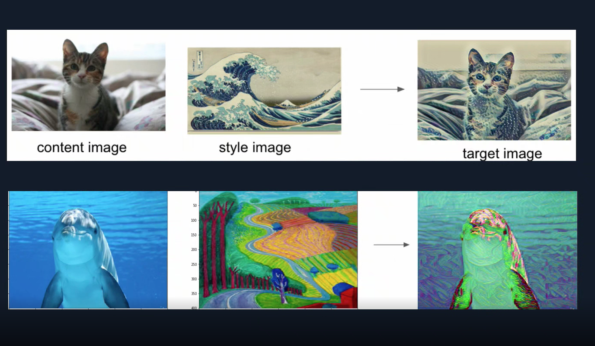

# Deeplearning-Style-Transfer

In this notebook, we’ll recreate a style transfer method that is outlined in the paper, Image Style Transfer Using Convolutional Neural Networks, by Gatys in PyTorch.

* [Project Introduction](https://mp.weixin.qq.com/s?__biz=MzIxNzU3MjA0OA==&mid=2247483680&idx=1&sn=93c8f718cc3ac83a2c584fbe014a09d7&chksm=97f6f69fa0817f89200277be03950bf9db699045f784819712fbe0bc358508bcc37932c2017a&token=312677330&lang=zh_CN#rd)

## Separating Style and Content
1. Style transfer relies on separating the content and style of an image. Given one content image and one style image, we aim to create a new, target image which should contain our desired content and style components
2. objects and their arrangement are similar to that of the content image
style, colors, and textures are similar to that of the style image

## Instructions
1. Load in a pre-trained VGG Net
2. Freeze the weights in selected layers, so that the model can be used as a fixed feature extractor
3. Load in content and style images
4. Extract features from different layers of our model
5. Complete a function to calculate the gram matrix of a given convolutional layer
6. Define the content, style, and total loss for iteratively updating a target image

## Versioning

We use [SemVer](http://semver.org/) for versioning. For the versions available, see the [tags on this repository](https://github.com/your/project/tags).

## Built With

* [Pytorch](https://pytorch.org/) - An open source machine learning framework that accelerates the path from research prototyping to production deployment.

## Authors

* **Tom Ge** - *Fullstack egineer* - [github profile](https://github.com/tomgtqq)

## License

This project is licensed under the MIT License
